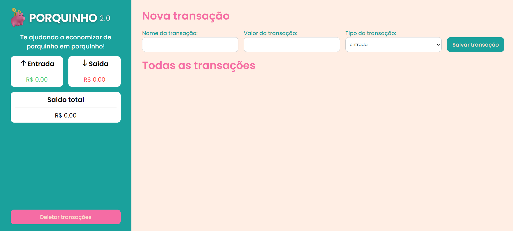

# Projeto Gestão Financeira 🐷

A ideia do projeto é permitir que o usuário realize o controle de suas transações através de uma interface prática. A aplicação permitir criar uma nova transação, deletar uma transação existente e atualizá-la.



## Funcionalidades 🤪

- Cadastrar novas transações, sendo elas de débito ou crédito;
- Atualizar transações existentes;
- Deletar transações existentes;

## Tecnologias 🤖

Esse projeto foi proposto para trabalhar com as tecnologias básicas do desenvolvimeno web: **HTML, CSS e JavaScript**.

## API JSON-Server 📝

A API JSON-Server foi utilizada para simular um servidor "básico", para permitir o contato de requisições HTTP (GET, POST, PULL e DELETE).

#### Instalação

```http
  npm init -y
  npm i json-server
```

#### Compilação

```http
  npm run json-server
```

## Autor 🧙🏼‍♂️

- [Ricardo Rebelo Junior](https://www.linkedin.com/in/rrebelojr/)
